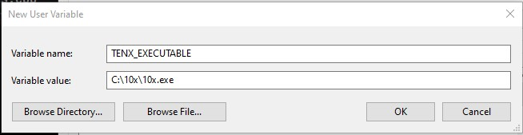

#UE5 10x editor source code accessor plugin

This is very WIP and some of the features dont work yet (like double clicking blueprint node doesnt yet bring you to the nodes c++ implementation). Only tested in Windows 10.

## Requirements
The plugin needs to know where 10x editor is installed, so currently it requires environment variable called "TENX_EXECUTABLE" that points to 10x.exe location.

## Installation
Download the .zip, extract it to your ProjectRootDir/Plugins, enable plugin from unreal engine plugins section and you should be good to go.

## Video clip
https://www.youtube.com/watch?v=5EUc5yNlKrU
