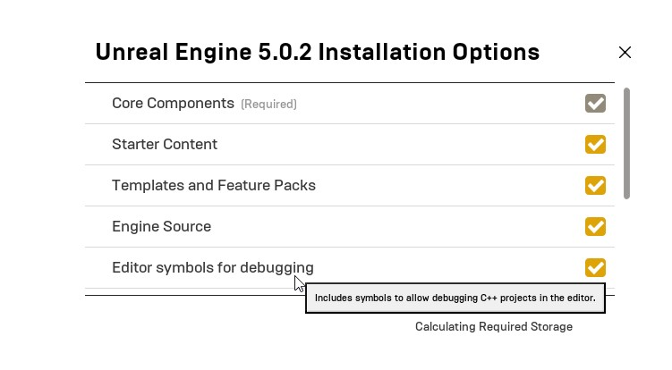

## UE5 10x editor source code accessor plugin
This plugin adds an option to select 10x editor as your source code editor in Unreal Editor.
Only tested in Windows 10 and Unreal Engine 5.0.2.

## Requirements
The plugin needs to know where 10x editor is installed, so currently it requires environment variable called "TENX_EXECUTABLE" that points to 10x.exe location.

Optionally, if you want to double click on Blueprint node and navigate its c++ implementation, you'll need Editor symbols for debugging installed.

## Installation
Download the .zip from release page, extract it to your ProjectRootDir/Plugins, enable plugin from unreal engine plugins section and you should be good to go.

## Video demo
https://www.youtube.com/watch?v=0tGCMEFzb7A
